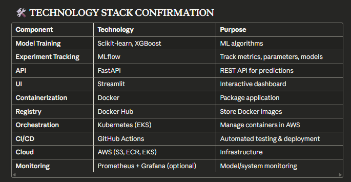

# MLOps End-to-End Project Planning
Great! Let's approach this like a professional ML team at a big tech company. I'll break this down systematically and start with Part 1: Project Definition & Planning.

🎯 PART 1: PROJECT DEFINITION & REQUIREMENTS GATHERING
Key Questions to Answer First:
1. Business Problem & Use Case

What problem are we solving?

Suggestion: Let's build a Customer Churn Prediction System (simple, practical, demonstrates full MLOps pipeline)
Alternative: House Price Prediction, Fraud Detection, Sentiment Analysis


What's the impact?

Business value: Reduce customer churn by 15%
Target: Marketing team can proactively reach at-risk customers


2. Data Questions

What data do we have?

Customer demographics (age, location, tenure)
Usage patterns (login frequency, feature usage)
Transaction history (revenue, plan type)


Data size & freshness?

For demo: Use Kaggle dataset (Telco Customer Churn)
In production: Daily batch updates from database


3. ML Model Requirements

What's good enough?

Target Metrics:

Recall ≥ 80% (catch most churners)
Precision ≥ 70% (avoid too many false alarms)
F1-Score ≥ 0.75
AUC-ROC ≥ 0.85


Model type?

Start: Logistic Regression (baseline)
Experiment: Random Forest, XGBoost, LightGBM


4. System Requirements

Latency: < 200ms for predictions (REST API)
Throughput: Handle 100 requests/second
Availability: 99.5% uptime


📋 PROJECT STRUCTURE (High-Level)
```
mlops-churn-prediction/
│
├── data/                          # Data versioning (DVC optional)
├── notebooks/                     # EDA & experiments
├── src/
│   ├── data_ingestion.py         # Data loading & validation
│   ├── data_preprocessing.py     # Feature engineering
│   ├── model_training.py         # Training pipeline
│   ├── model_evaluation.py       # Metrics & validation
│   └── prediction_service.py     # Inference API
│
├── tests/
│   ├── unit_tests/               # Function-level tests
│   ├── integration_tests/        # Pipeline tests
│   ├── data_tests/               # Data quality tests
│   └── model_tests/              # Model performance tests
│
├── api/                          # FastAPI REST endpoints
├── streamlit_app/                # Streamlit UI
├── mlflow/                       # Experiment tracking
├── docker/                       # Dockerfiles
├── k8s/                          # Kubernetes manifests
├── .github/workflows/            # CI/CD pipelines
└── config/                       # Configuration files
```
🧪 TESTING STRATEGY (ML-Specific)
1. Data Tests

Schema validation (correct columns, dtypes)
Range checks (age > 0, prices reasonable)
Null value checks
Data drift detection (distribution changes)

2. Model Tests

Performance tests (accuracy, precision, recall)
Invariance tests (predictions shouldn't change for same input)
Directional expectation (increasing tenure → lower churn)
Slice-based evaluation (performance per demographic)

3. Integration Tests

End-to-end pipeline execution
API response validation
Model loading/serving

4. Infrastructure Tests

Docker container health
Kubernetes deployment readiness
API load testing




📊 EVALUATION METRICS FRAMEWORK
Offline Metrics (During Training)

Classification Metrics:

Confusion Matrix
Precision, Recall, F1-Score
AUC-ROC, AUC-PR


Business Metrics:

Cost of false positives (unnecessary interventions)
Cost of false negatives (lost customers)
Expected revenue impact


Online Metrics (In Production)

Model Performance:

Prediction latency (p50, p95, p99)
Throughput (requests/sec)
Error rate


Data Quality:

Input data validation failures
Feature distribution drift


Business KPIs:

Actual churn rate in predicted segments
Intervention success rate


🚀 DEVELOPMENT PHASES
### Phase 1: Foundation (We'll start here)

✅ Project setup & structure
✅ Data exploration & baseline model
✅ Basic training pipeline
✅ MLflow integration

### Phase 2: API & UI

FastAPI endpoint development
Streamlit dashboard
Local testing

### Phase 3: Containerization

Dockerfile creation
Docker Compose for local stack
Push to Docker Hub

### Phase 4: Testing Suite

Unit tests for all components
Data validation tests
Model performance tests
Integration tests

### Phase 5: CI/CD

GitHub Actions workflows
Automated testing
Automated Docker builds

### Phase 6: Kubernetes Deployment

K8s manifests
Deployment to AWS EKS
Service exposure & monitoring


🎯 PROPOSED PROJECT: Customer Churn Prediction
Dataset: Telco Customer Churn (Kaggle)
Problem: Predict if a customer will churn (binary classification)
Features: Demographics, services, contract details
Target: Churn (Yes/No)

✅ YOUR CONFIRMATION NEEDED
Before we proceed to Phase 1 implementation, please confirm:

Project Choice: Are you okay with Customer Churn Prediction, or prefer another use case?
Technology Stack: Any changes to the proposed tools?
Scope: Should we include model monitoring (Prometheus/Grafana) or keep it simpler?
AWS Services: Do you have AWS account access, or should I plan for local Kubernetes (minikube)?

Once you confirm, I'll provide:

Detailed Phase 1 implementation (code structure, data pipeline, baseline model, MLflow setup)
Step-by-step instructions to get started

What's your decision? Ready to dive into Phase 1? 🚀